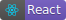
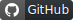

<p align="center">
  
</p>

<p align="center">
  
  
  
</p>

# Semana Omnistack 11

**Be The Hero** é uma aplicação que visa conectar ONG's que precisam de ajuda e pessoas dispostas a ajudar. Através da interface web a ONG's cadastra seus dados e adiciona informações sobre os casos. E no app mobile, as pessoas podem entrar em contato com as instituições através de e-mail ou whatsapp.


## ✋🏻 Be The Hero Backend e Web 

* [Be The Hero Backend](https://github.com/vitorsemidio-dev/be-the-hero-backend) 
* [Be The Hero Web](https://github.com/vitorsemidio-dev/be-the-hero-web) 


## 🚀 Como executar o projeto

0. **Pré-requisito: ter o backend rodando**
1. Clone este repositório através do comando `git clone https://github.com/vitorsemidio-dev/be-the-hero-mobile`
2. Troque para o diretório do projeto
3. Rode `yarn` ou `npm install` para instalar todas as dependências
4. Rode `expo start` para iniciar a aplicação


## 🎓 Aprendizado

```
  ├── Expo MailComposer
  ├── FlatList
  └── React Navigation
```


## 📜 FlatList

Componente utilizado para listagem de casos. Por padrão, o mobile só lista os casos da primeira página (5 casos). Com este componente, quando o usuário chega perto do fim do scroll, ele realiza uma nova requisição para buscar os dados da página seguinte.

```jsx
export default Incidents() {
  return (
    <FlatList
      showsVerticalScrollIndicator={true}
      onEndReached={loadIncidents}
      onEndReachedThreshold={0.8}
    />
  )
}
```

